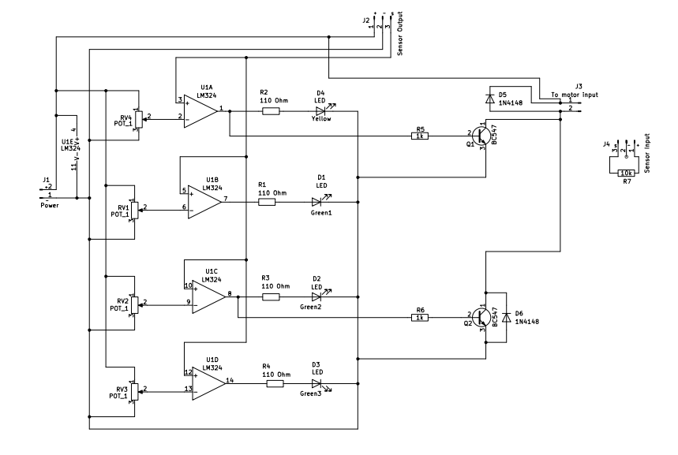
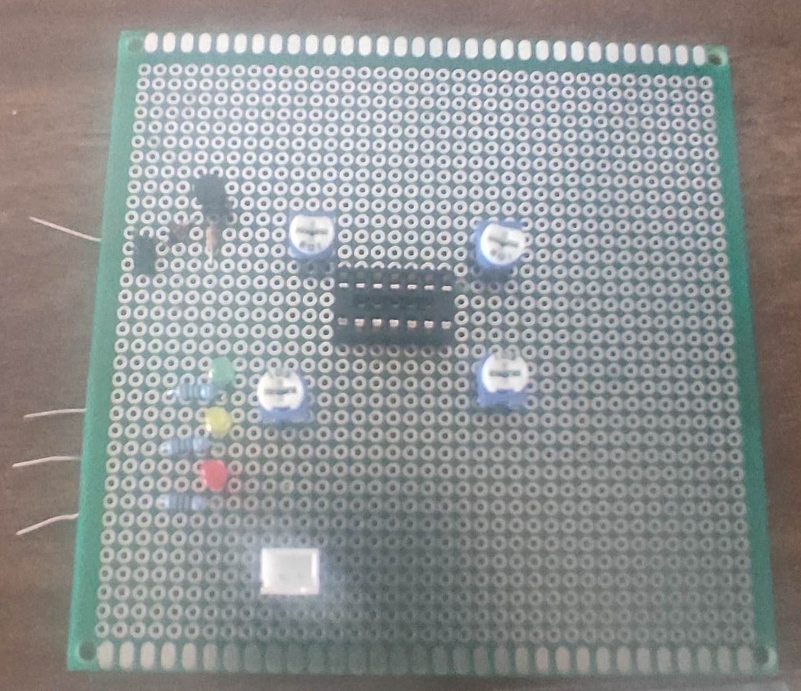

# Automatic Irrigation Controller PCB – Analog Comparator Based Design

## Overview
This project is an automatic irrigation control system designed using an **LM339 quad comparator** to monitor soil moisture and control a water pump based on predefined thresholds.

The system operates entirely using **analog circuitry**, eliminating the need for a microcontroller, making it cost-effective and reliable.

---

## Features
- Soil moisture detection using analog sensor
- LM339 comparator-based threshold detection
- Multi-level irrigation control:
  - **10%, 30%, 60% → Motor ON**
  - **90% → Motor OFF**
- Fully hardware-based system (no microcontroller)
- Low-cost and energy-efficient design

---

## Working Principle
The soil moisture sensor outputs an analog voltage proportional to moisture content.

This voltage is compared with reference voltages using the **LM339 comparator**:

- At **10%, 30%, and 60% moisture levels**, the system activates the motor to irrigate the soil.
- When moisture reaches **90%**, the comparator switches state and turns OFF the motor.

This ensures efficient water usage and prevents overwatering.

---

## Design Highlights
- Implemented **multi-threshold analog control system**
- Designed **voltage divider networks** for precise threshold levels
- Ensured **stable switching and noise immunity**
- Achieved motor control without microcontroller dependency

---

## Hardware Components
- LM339 Comparator IC  
- Soil Moisture Sensor  
- Resistors & Capacitors  
- Transistor (Motor Driver)  
- Power Supply  

---

## Design Workflow
1. Requirement analysis (automatic irrigation system)
2. Component selection (LM339 comparator)
3. Circuit design (threshold logic)
4. Schematic capture
5. PCB layout and routing
6. Gerber file generation
7. PCB fabrication
8. Hardware testing and calibration

---

## PCB Design(Kicad)
- Designed schematic and PCB layout
- Performed routing and component placement
- Generated **Gerber files and BOM**

---

## Included Files

- **Schematic (`schematic.png / schematic.pdf`)**  
  Circuit design showing LM339 comparator-based threshold system  

- **PCB Layout (`pcb-layout.png`)**  
  Final routed PCB design ready for fabrication  

- **Gerber Files (`gerber-files/`)**  
  Manufacturing files used for PCB fabrication  

- **Bill of Materials (`bom.csv`)**  
  List of all electronic components with values and quantities  

- **Hardware Images (`hardware.jpg`)**  
  Photos of the assembled and tested PCB  

- **Design Files (`design/`)**  
  Original design files (KiCad / Altium)  

---

## Results
- Successfully automated irrigation system
- Achieved reliable switching across all moisture thresholds
- Reduced manual effort and improved water efficiency

---

## Skills Demonstrated
- PCB Design & Layout  
- Schematic Capture  
- Analog Circuit Design  
- Comparator Circuits (LM339)  
- Component Selection  
- Gerber File Generation  
- Hardware Debugging  

---

## Images

### Block Diagram

### Schematic

### PCB Layout

### Hardware Prototype

---

## Future Improvements
- Add microcontroller-based smart control
- IoT monitoring system
- Mobile app integration

---

## Author
**Manepalli Brahmateja**  
GitHub: https://github.com/manepalliteja37  
